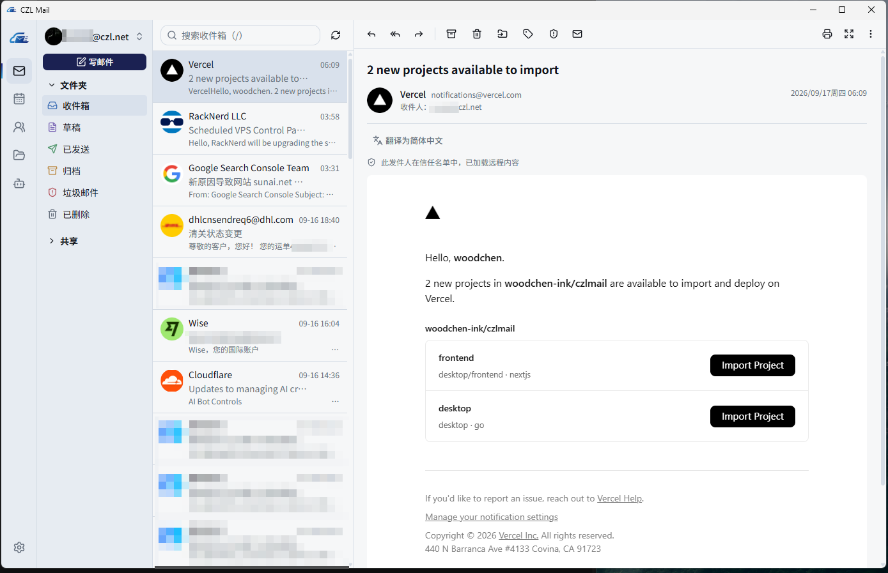
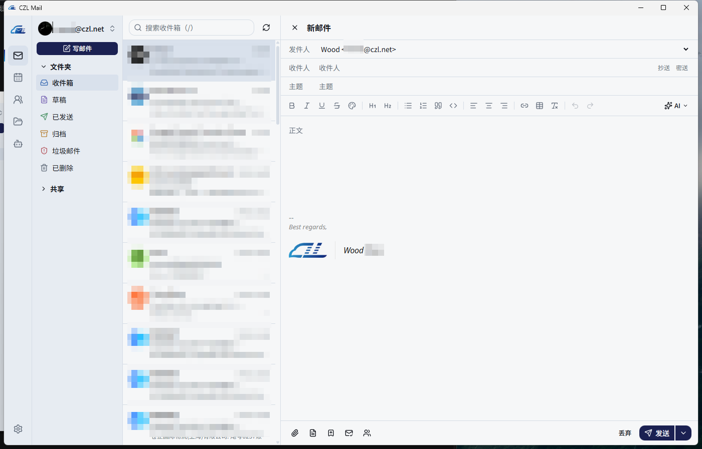
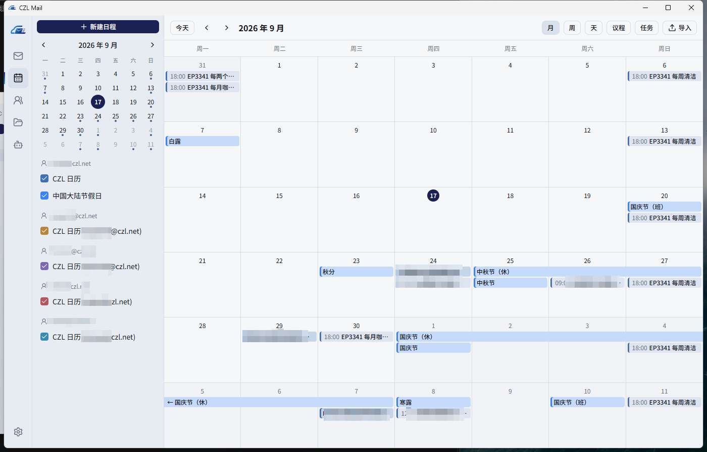
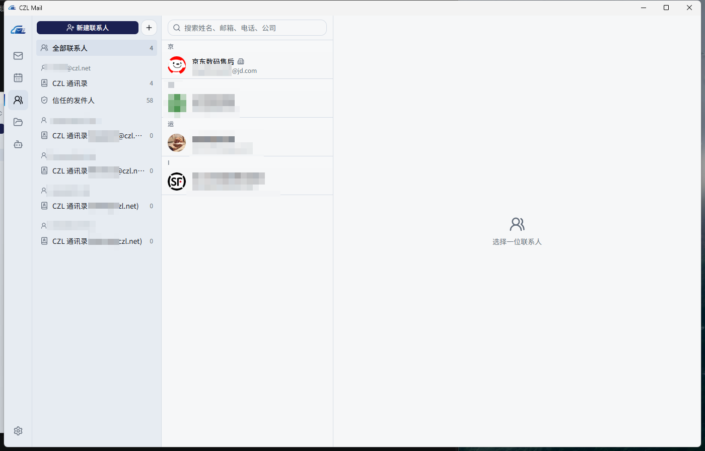
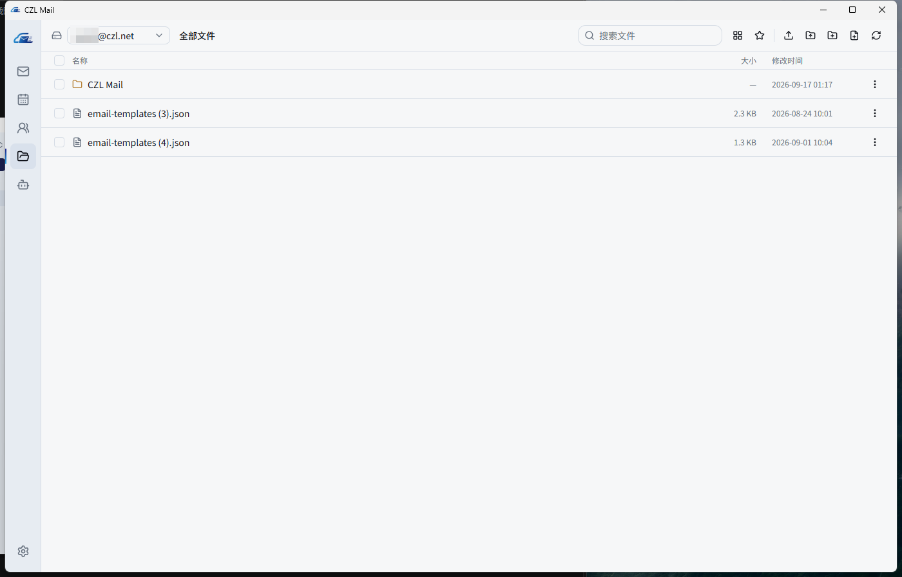
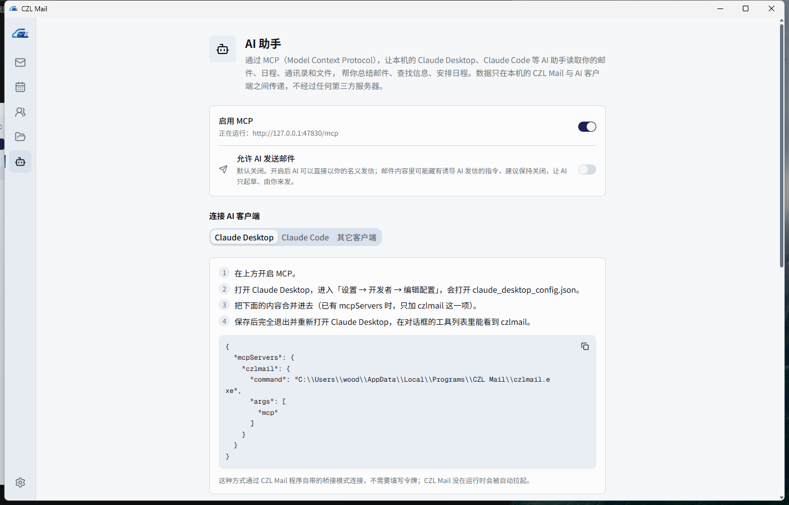
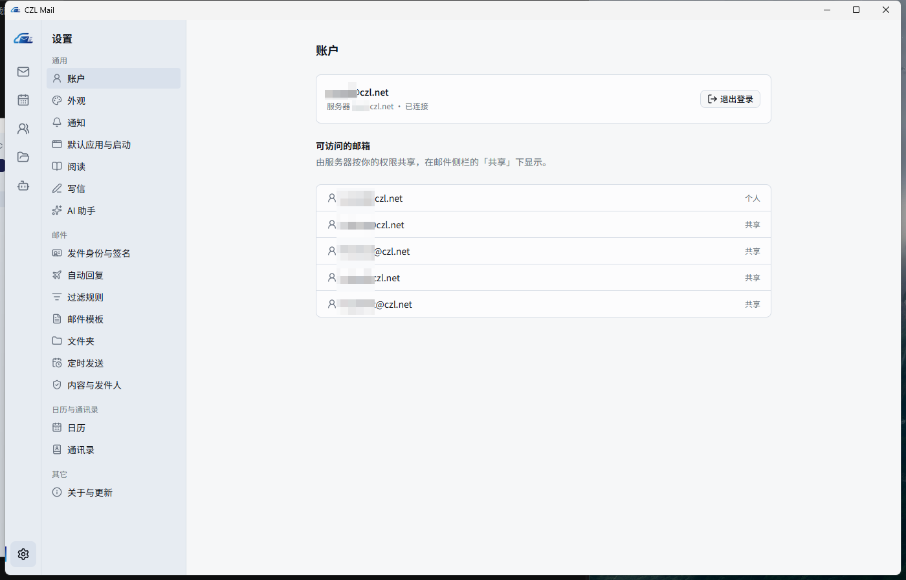

<p align="center"></p>

<h1 align="center">CZL Mail</h1>

<p align="center">
为 <a href="https://stalw.art">Stalwart</a> 打造的 <a href="https://jmap.io">JMAP</a> 原生桌面客户端 ——
邮件、日历、通讯录、网盘，内置 <b>MCP 服务</b> 与 <b>AI 助手</b>。
</p>

<p align="center"><a href="README.md">English</a> · <b>简体中文</b></p>

---

<p align="center"></p>

## 为什么要写这个项目

[Bulwark](https://github.com/bulwarkmail/webmail) 是 Stalwart 上很好的 JMAP 网页邮箱，本项目的很多设计都参考了它。
但网页邮箱始终活在浏览器标签页里。CZL Mail 的目标是：**只要 Stalwart + 一个原生客户端**，不再需要单独部署 Bulwark。

- **原生启动，秒开。** Go + WebView2 原生程序，不依赖浏览器，也不用在服务器上部署网页应用。
- **邮件缓存，打开即看。** 所有邮件缓存在本地 SQLite，通过一条 JMAP 推送（EventSource）连接实时保持同步；
  阅读、搜索、切换文件夹读的是本地磁盘，而不是等网络。
- **系统级通知。** 新邮件和日程提醒走操作系统通知中心；关掉窗口驻留托盘、开机自启后都能及时收到。
- **让 Agent 使用你的邮箱。** 内置本地 MCP 服务，Claude、Codex 等 Agent 可以读取、搜索、发送邮件，查看日程、查找联系人 ——
  需要你在软件里开启，并使用本地令牌。
- **AI 就在手边。** 接入任意兼容 OpenAI Responses API 的模型：一键原地翻译邮件、润色或翻译草稿、
  说出回复意图让 AI 帮你起草。

## 功能

**邮件** —— 多账号与共享邮箱 · 富文本写信（HTML 签名、模板、已读回执、分开发送、定时发送）· 草稿自动保存 ·
文件夹新建 / 重命名 / 移动 / 删除 · 全文搜索（支持中文）· 默认拦截远程内容，信任发件人名单与 Bulwark 共用 ·
批量操作 · 一键退订（RFC 8058）· 在邮件里直接回复日历邀请 ·
附件一键本地打开 · 右键从服务器拉取整个文件夹

**日历** —— 月 / 周 / 天 / 议程视图，跨天日程连成横条显示 · 右侧编辑面板（会议链接、参加者与邀请、回复邀请、
多个提醒、重复规则）· 任务 · 日历管理 · 导入 `.ics` / `webcal:` · 桌面提醒

**通讯录** —— 完整的 JSContact 编辑（照片、姓名分量、工作单位、地址、在线服务、纪念日、类别）· 群组 · 通讯录管理 · 导入 vCard

**网盘** —— Stalwart 文件存储，列表 / 网格视图、收藏、剪切 / 复制 / 粘贴、拖入窗口上传

**服务端设置** —— 发件身份与 HTML 签名、假期自动回复、Sieve 过滤规则（规则编辑器与 Bulwark 互通，另有原始 Sieve 编辑器）

**桌面集成** —— 托盘、开机自启、设为默认的 `mailto:` / `.ics` / `webcal:` 应用、基于 GitHub Releases 的自动更新（SHA-256 校验）

## 截图

| 写信（HTML 签名） | 日历（跨天日程连成横条） |
|---|---|
|  |  |

| 通讯录 | 网盘 |
|---|---|
|  |  |

| MCP：接入 AI Agent | 设置 |
|---|---|
|  |  |

## MCP：让 Agent 使用你的邮箱

在软件的 **AI 助手 → MCP** 页面开启，页面上有可以直接复制的配置。

工具：`list_accounts`、`list_mailboxes`、`list_emails`、`search_emails`、`read_email`、`mark_read`、
`send_email`、`list_events`、`create_event`、`search_contacts`、`list_files`。

两种接入方式：

```bash
# stdio（由程序转接到正在运行的实例）
claude mcp add --scope user czlmail -- "C:\Users\<你>\AppData\Local\Programs\CZL Mail\czlmail.exe" mcp

# Streamable HTTP，监听 127.0.0.1，需要 Bearer 令牌
claude mcp add --scope user --transport http czlmail http://127.0.0.1:47830/mcp --header "Authorization: Bearer <令牌>"
```

服务只监听本机回环地址，必须带令牌，并拒绝来自浏览器的跨源请求。邮件内容始终作为数据交给模型，而不是指令。

## AI 助手

在 **设置 → AI 助手** 填写接口地址、API Key（保存在系统钥匙串）和模型名称。任何实现了 OpenAI **Responses API**
（`/v1/responses`）的服务都可以使用。只有配置并启用后，界面上才会出现 AI 按钮。

- **翻译邮件**：一键把邮件翻译成默认语言，只替换文字，排版与样式保持原样，可随时切回原文
- **润色 / 翻译草稿**：写信时对正文一键优化或翻译
- **按意图回复**：输入「同意报价，但希望周三前发货」，AI 起草完整回复

## 安装

从 [Releases](https://github.com/woodchen-ink/czlmail/releases) 下载最新版本：

- Windows：`czlmail-amd64-installer.exe`（按用户安装，无需管理员权限）
- macOS：`czlmail-darwin-universal.zip`（未签名，首次打开请右键 → 打开）

登录时填写服务器地址、邮箱，以及在 Stalwart 里生成的**应用专用密码**。

## 从源码构建

需要 Go 1.26+、Node 22+、pnpm 与 [Wails v2 CLI](https://wails.io/docs/gettingstarted/installation)（v2.12）。

```bash
cd desktop
wails dev      # 开发模式，热重载
wails build    # 产物在 build/bin/
go test ./...  # 单元测试
```

Windows 上可以用 `build.bat v0.1.0` 一次生成程序与 NSIS 安装包。

集成测试连接真实服务器，凭据只从环境变量读取（`CZLMAIL_TEST_SESSION`、`CZLMAIL_TEST_USER`、`CZLMAIL_TEST_PASS`），未提供时自动跳过。

## 安全

- 邮件正文经 DOMPurify 清洗，在不同源的沙箱 iframe 中渲染，并有严格的 CSP。
- 远程图片默认拦截，只对信任的发件人放行；信任按完整地址，从不按域名。
- 凭据与 API Key 只保存在系统钥匙串，没有明文回落。
- 在线更新只安装与发布版 `SHA256SUMS` 一致的安装包。

## 反馈

使用中遇到问题或有建议，欢迎提 [Issue](https://github.com/woodchen-ink/czlmail/issues)，或到[论坛反馈帖](https://sunai.net/t/topic/1485)留言。

## 许可证

[AGPL-3.0](LICENSE)，与 Bulwark 相同。

## 致谢

- [Stalwart](https://stalw.art) —— 本客户端服务的邮件服务器
- [Bulwark](https://github.com/bulwarkmail/webmail) —— 功能设计与过滤规则格式的参考
- [go-jmap](https://git.sr.ht/~rockorager/go-jmap)、[Wails](https://wails.io)、[TipTap](https://tiptap.dev)、[shadcn/ui](https://ui.shadcn.com)
